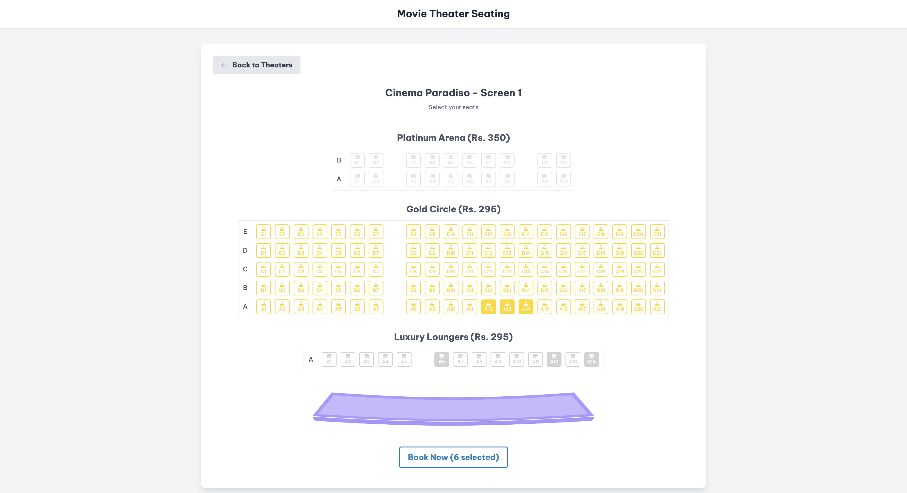

# Movie Theater Seating Layout App

A dynamic and interactive web application for selecting seats in a movie theater. This application is designed with a highly customizable layout engine, allowing for detailed and varied theater configurations.


## Features

- **Multiple Theater Configurations**: Easily define and switch between different theater setups, each with unique layouts, seat types, and pricing.
- **Advanced Layout Customization**:
  - Define sections (e.g., Orchestra, Balcony) with specific seat types.
  - Utilize `rowPatterns` to create complex arrangements of seats and gaps within each row, allowing for precise control over the seating map.
  - Configure different `seatTypes` (e.g., Standard, Premium, VIP, Wheelchair Accessible) with unique icons, colors, and pricing.
- **Interactive Seating Chart**: Visually represents seats with statuses: available, selected, or booked.
- **Seat Selection & Booking Simulation**: Click to select available seats. A "Book Now" button simulates the booking process for selected seats.
- **Dynamic Pricing**: Seat prices are determined by their `seatType`.
- **Responsive Design**: Adapts to various screen sizes for a seamless user experience.
- **User Notifications**: Provides instant feedback for actions like seat selection, booking confirmations, or selection limits.
- **Configurable Selection Limits**: Set a maximum number of seats a user can select at once.
- **Persistent State (Optional)**: Seat selections and bookings can persist across sessions using IndexedDB (if `useSeats` hook's IndexedDB features are fully enabled).

## Layout Customization

The seating layout is highly configurable through the `theaterLayouts.ts` file and the types defined in `types.ts`. Key customization points include:

- **`theaterConfigs`**: An array where each object defines a distinct theater. Each theater has:
  - `id`: A unique identifier.
  - `name`: Display name for the theater.
  - `layout`: The core layout definition (see below).
  - `screenImageUrl` (optional): Path to an image representing the screen for this specific theater.
- **`Layout` Definition**:
  - **`sections`**: An array defining different areas within the theater (e.g., "Platinum Arena", "Gold Circle"). Each section specifies:
    - `id`: Unique ID for the section.
    - `name`: Display name.
    - `seatType`: The default `seatType` for seats in this section.
    - `rows`: Number of rows in the section.
    - `cols`: Number of columns (seats/gaps) in the widest row of the section.
    - `rowPatterns`: An array of patterns, where each pattern defines a row's structure. A pattern is an array of objects like `{ type: 'seats', count: X }` or `{ type: 'gap', count: Y }`, allowing for precise placement of seats and gaps. This enables non-uniform row lengths and aisle placements.
  - **`seatTypes`**: An object mapping seat type names (e.g., "platinum", "gold", "vip") to their properties:
    - `icon` (optional): A React component (e.g., from Heroicons) to display on the seat.
    - `color`: The color for the seat.
    - `price`: The price for this seat type.
  - **`maxSeatsSelectable`** (defined in `SeatingLayoutProps`): Control the maximum number of seats a user can select.

This structured configuration allows for creating a wide variety of theater layouts, from simple arrangements to complex, multi-section venues with different pricing tiers and accessibility options.

## Screenshots

Here are some views of the application:




## Tech Stack

- **Frontend**: React, TypeScript, Vite
- **Styling**: Tailwind CSS
- **State Management**: React Hooks (useState, useEffect, useCallback, custom hooks)
- **Testing**: Vitest, React Testing Library
- **Linting/Formatting**: Prettier
- **Git Hooks**: Husky, lint-staged
- **(Client-side Storage)**: IndexedDB (via `idb` library)

## Getting Started

To get a local copy up and running, follow these simple steps.

### Prerequisites

- Node.js (v18.x or later recommended)
- npm (comes with Node.js)

### Installation

1.  Clone the repo:
    ```sh
    git clone <YOUR_REPOSITORY_URL>
    ```
2.  Navigate to the project directory:
    ```sh
    cd seating-layout-app
    ```
3.  Install NPM packages:
    ```sh
    npm install
    ```

### Running the Development Server

```sh
npm run dev
```

This will start the Vite development server, typically at `http://localhost:5173`.

## Available Scripts

In the project directory, you can run:

- `npm run dev`: Runs the app in development mode.
- `npm run build`: Builds the app for production to the `dist` folder.
- `npm run preview`: Serves the production build locally.
- `npm run test`: Launches the test runner in interactive watch mode.
- `npm run format`: Formats code in the `src` directory using Prettier.
- `npm run prepare`: (Internal script used by Husky) Installs Git hooks.

## License

Distributed under the MIT License. See `LICENSE` file for more information (if you add one).

---

Built by Harsha Attray
